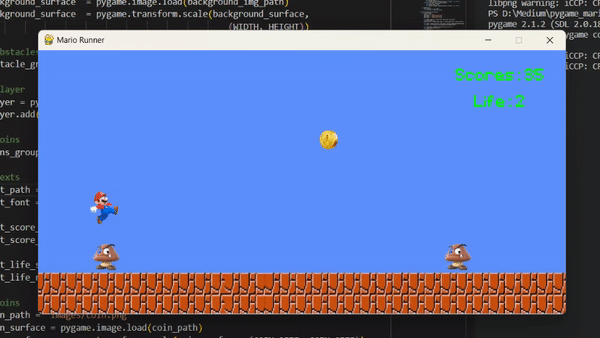

### Mario Run with Pygame 




This is the repo of a simple Mario run game built with Pygame and Python.

After cloning the repository to your local directory, make sure you have pygame installed.

Once you have downloaded the project and installed the required packages, you
can run and play the game with the following command:

```{python}
python ./game.py
```

fonts and images folder contain the font and image components for this game.
If you would like to follow the tutorial on my Medium article, you can download 
these starter files from the starter files branch.

For the tutorial you can find on my Medium article:

Mario Run with Pygame (Part I) : https://medium.com/@wang33he77/mario-run-with-pygame-part-i-50f0eedfeb92

Mario Run with Pygame (Part II) : https://medium.com/@wang33he77/mario-run-with-pygame-part-ii-42aad8a42cb7

Mario Run with Pygame (Part III) : https://medium.com/@wang33he77/mario-run-with-pygame-part-iii-32eb3589f47e

If you think this repo is helpful or interesting, please follow me on github or checkout my personal portfolio page:
https://yushanwang9801.github.io/